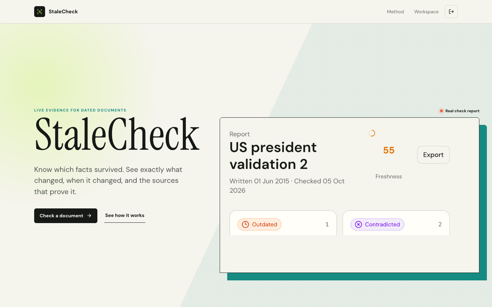
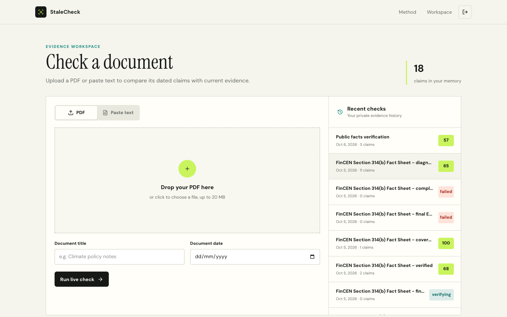
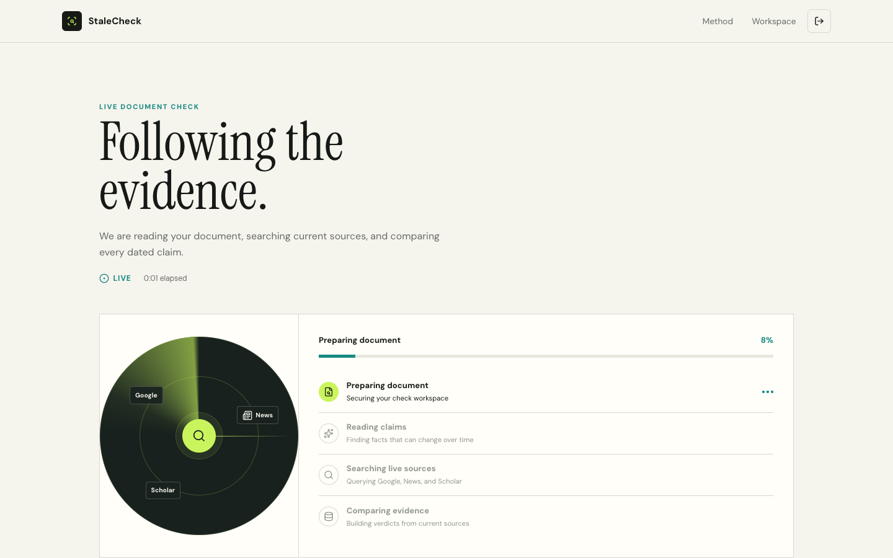
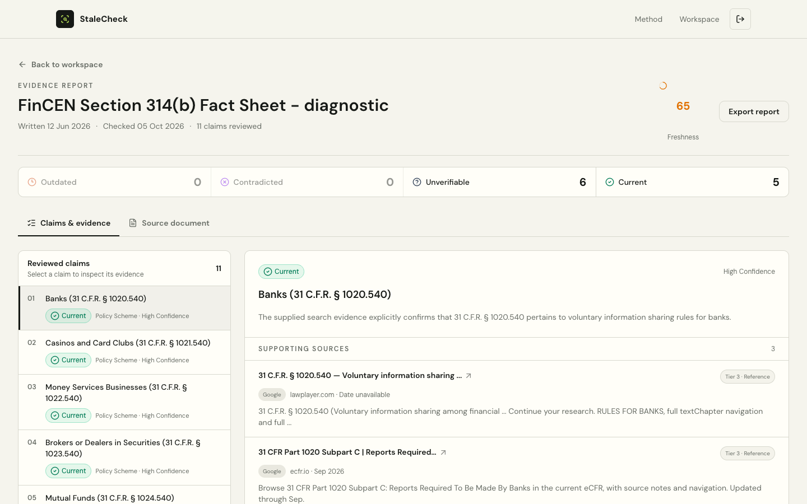
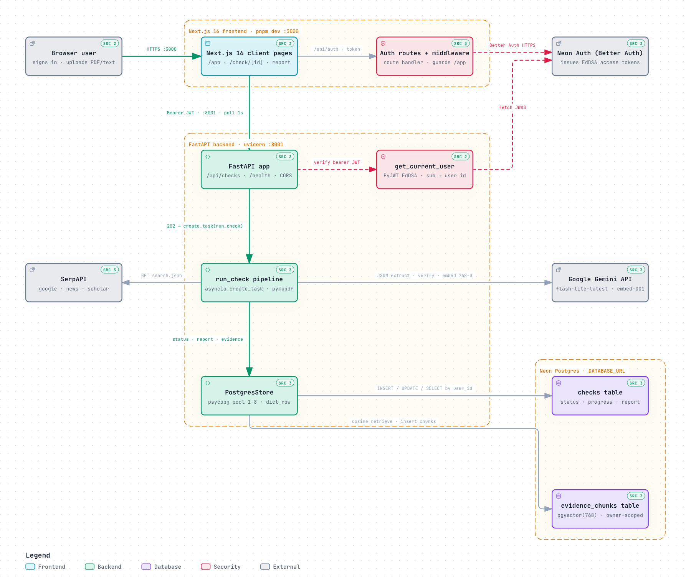
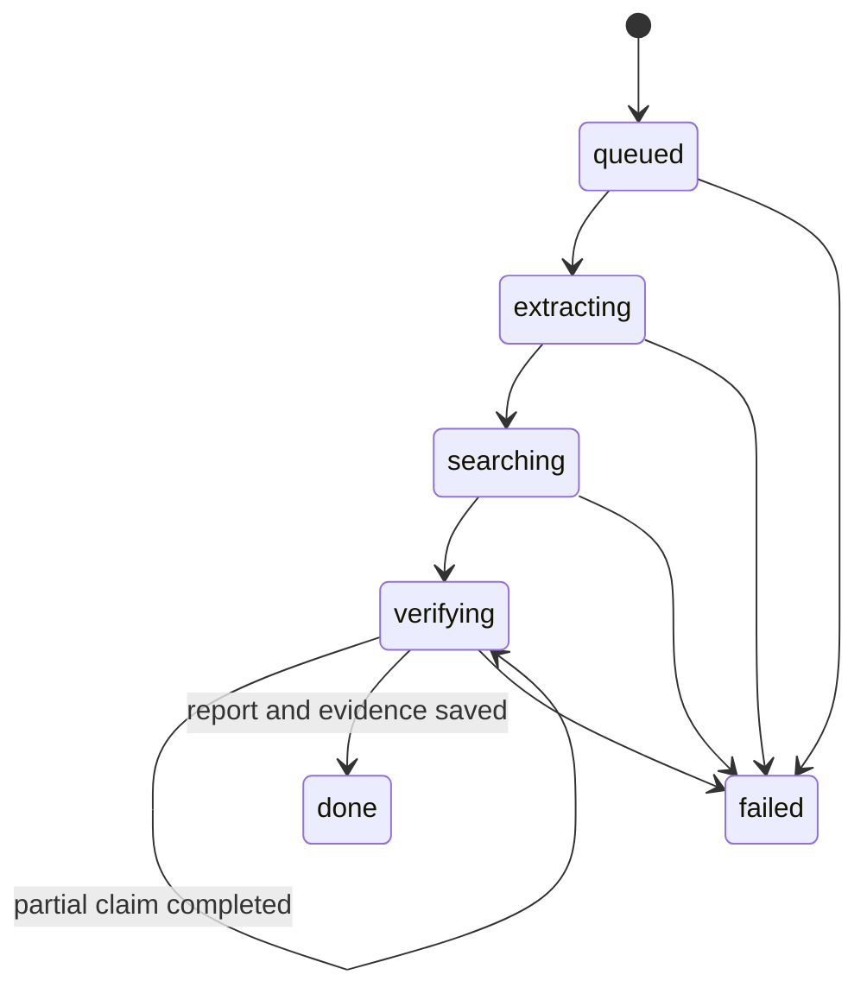

# StaleCheck

> Turn a dated document into a living, cited evidence report.

**SerpApi India Hackathon 2026** | **Track: Knowledge & Public Interest**

[Repository](https://github.com/omkarbandikatte/SerpAPI-StaleCheck) | [Backend API guide](backend/README.md) | [Frontend guide](frontend/README.md)

StaleCheck accepts a text-based PDF or pasted text, finds claims that can become stale, searches the live web through SerpApi, and explains whether each claim is still current. Every result includes the evidence, source quality, confidence, and the part of the original document that was checked.

This is a live full-stack implementation. It does not generate sample reports, mock search results, or fallback evidence.



## The problem

Reports, policy notes, study material, compliance documents, and internal knowledge bases age silently. A document may still look authoritative even when its office holders, statistics, rules, rankings, or programs have changed. Finding those changes manually requires identifying every time-sensitive claim and repeating research across general search, current news, and scholarly sources.

StaleCheck makes that review repeatable:

1. Upload a PDF or paste text and provide the date the document was written.
2. Extract only substantive, time-sensitive claims and preserve their exact text positions.
3. Search Google, Google News, and Google Scholar for newer evidence.
4. Compare live results with the dated claim and return a grounded verdict.
5. Save the report and selected evidence in a private, account-scoped vector memory.
6. Reuse relevant evidence from earlier checks as context while keeping live search authoritative.

## Product walkthrough

### 1. Private evidence workspace

Users can upload a PDF up to 20 MB or paste up to 120,000 characters. The workspace also shows account-scoped history, status, claim counts, and freshness scores.



### 2. Visible live-search progress

The processing view streams partial claims and shows the current extraction, search, and verification phase. Google, News, and Scholar are visible because all three are part of the result, not decorative integrations.



### 3. Evidence-first report

The final report provides a freshness score, verdict filters, claim-level confidence, current values, change dates, source tiers, snippets, outbound citations, the source document, and export support.



## Why SerpApi is essential

StaleCheck depends on current search data. Without SerpApi there is no evidence set and therefore no verdict.

| SerpApi engine | What it contributes |
| --- | --- |
| Google Search | Official pages, primary sources, current organizations, and broad web evidence |
| Google News | Recent changes, announcements, and time-sensitive reporting |
| Google Scholar | Research evidence and higher-quality academic context |

For every extracted claim, the backend builds a date-aware query and runs the three engines concurrently through `https://serpapi.com/search.json`. It requests the top three results per engine, retries transient failures once, normalizes the results into one evidence model, and records how many searches contributed to the report.

The verifier is explicitly instructed to use supplied evidence only. Prior vector memory may add context, but live SerpApi results remain authoritative.

## Verdicts and scoring

Each claim receives one of four verdicts:

| Verdict | Meaning | Score weight |
| --- | --- | ---: |
| `current` | Current evidence supports the dated claim | 100 |
| `outdated` | The claim was once plausible but a newer value or state now applies | 55 |
| `contradicted` | Current evidence directly conflicts with the claim | 15 |
| `unverifiable` | Evidence is absent, weak, conflicting, or indirect | 35 |

The document freshness score is the rounded mean of its claim weights. This makes the score deterministic and inspectable rather than a second opaque model judgment.

## Architecture

The diagram below is exported from the repository's source-backed Archify model. It traces browser authentication, JWT verification, asynchronous checks, live providers, persistence, and owner-scoped vector retrieval.

[](.archify/architecture-stalecheck-20261006-002622/stalecheck.html)

**[Open the interactive system architecture](.archify/architecture-stalecheck-20261006-002622/stalecheck.html)** to inspect component details and their verified source references.

### Processing lifecycle



1. FastAPI validates the Neon Auth JWT issuer, audience, signature, and user UUID.
2. PyMuPDF extracts text from PDFs; pasted text enters the same normalized pipeline.
3. Gemini identifies office-holder, statistic, policy, event-date, ranking, and scientific claims.
4. Claim workers run with bounded concurrency. Search overlaps embedding and private-memory retrieval.
5. SerpApi evidence is normalized and ranked into source tiers.
6. Gemini returns structured verdict JSON; malformed provider JSON is repaired and validated.
7. Partial claims are persisted and surfaced while processing continues.
8. Evidence is embedded, batched into pgvector, and scoped to the authenticated user.
9. The completed report and extracted document text are persisted for history and export.

## Private RAG memory

This is retrieval-augmented verification, not a generic chat wrapper.

- Evidence snippets are embedded with `gemini-embedding-001` at 768 dimensions.
- pgvector stores the snippet, source URL, source metadata, claim ID, check ID, and owner ID.
- The HNSW index uses cosine distance.
- A new claim retrieves up to five earlier chunks for the same user at similarity `>= 0.55`.
- Evidence from the active check is excluded to avoid self-retrieval.
- Retrieved memory supplements live results; it cannot replace current SerpApi evidence.

## Security and account isolation

- Email/password and Google OAuth are handled by Neon Managed Better Auth.
- Protected frontend routes use Next.js middleware.
- FastAPI accepts only EdDSA JWTs from the configured Neon issuer and audience.
- Check history, status, reports, and vector retrieval are filtered by JWT subject.
- `user_id` is non-null on checks and evidence, with foreign keys to the Auth user.
- Another account receives `404` even if it knows a check ID.
- Original PDF bytes and raw SerpApi responses are not retained.
- Secrets live in ignored environment files and are never committed.

## Technology

| Layer | Technology |
| --- | --- |
| Frontend | Next.js 16.3, React 19, TypeScript, Tailwind CSS 4 |
| API | FastAPI, Pydantic 2, HTTPX, PyMuPDF |
| Authentication | Neon Managed Better Auth, EdDSA JWT, JWKS |
| Search | SerpApi: Google, Google News, Google Scholar |
| AI | Gemini structured generation and `gemini-embedding-001` |
| Data | Neon Postgres, psycopg connection pool, JSONB |
| Vector retrieval | pgvector `vector(768)` with HNSW cosine index |
| Testing | Pytest, FastAPI TestClient, Next.js production build |

## Repository structure

```text
.
|-- backend/
|   |-- app/
|   |   |-- auth.py       # JWT validation
|   |   |-- main.py       # FastAPI routes and background jobs
|   |   |-- pipeline.py   # extraction, search, verification, embeddings
|   |   |-- store.py      # owner-scoped Postgres and pgvector access
|   |   `-- models.py     # API and report contracts
|   `-- tests/test_api.py
|-- frontend/
|   |-- app/              # landing, auth, workspace, processing, report routes
|   |-- components/       # auth, layout, report, and UI components
|   `-- lib/              # API, auth, verdict, and shared types
`-- docs/images/          # real application screenshots
```

## Run locally

### Prerequisites

- Python 3.11+
- Node.js 20.9+
- Corepack with pnpm 10.15.1
- A SerpApi API key
- A Gemini API key
- A Neon project with Managed Auth and pgvector enabled

### 1. Clone

```bash
git clone https://github.com/omkarbandikatte/SerpAPI-StaleCheck.git
cd SerpAPI-StaleCheck
```

### 2. Create the database schema

Run this SQL in the Neon SQL editor for the same database used by Managed Auth:

```sql
CREATE EXTENSION IF NOT EXISTS vector;

CREATE TABLE public.checks (
	id text PRIMARY KEY,
	user_id uuid NOT NULL REFERENCES neon_auth."user"(id) ON DELETE CASCADE,
	owner_name text NOT NULL,
	owner_email text NOT NULL,
	title text NOT NULL,
	doc_as_of date NOT NULL,
	status text NOT NULL CHECK (status IN (
		'queued', 'extracting', 'searching', 'verifying', 'done', 'failed'
	)),
	progress jsonb NOT NULL DEFAULT '{"done": 0, "total": 0}'::jsonb,
	partial_claims jsonb NOT NULL DEFAULT '[]'::jsonb,
	document_text text,
	report jsonb,
	error text,
	searches_used integer NOT NULL DEFAULT 0,
	created_at timestamptz NOT NULL DEFAULT now(),
	updated_at timestamptz NOT NULL DEFAULT now()
);

CREATE INDEX checks_user_created_idx
	ON public.checks (user_id, created_at DESC);

CREATE TABLE public.evidence_chunks (
	id bigserial PRIMARY KEY,
	check_id text NOT NULL REFERENCES public.checks(id) ON DELETE CASCADE,
	user_id uuid NOT NULL REFERENCES neon_auth."user"(id) ON DELETE CASCADE,
	claim_id text NOT NULL,
	content text NOT NULL,
	source_url text NOT NULL,
	metadata jsonb NOT NULL DEFAULT '{}'::jsonb,
	embedding vector(768) NOT NULL,
	created_at timestamptz NOT NULL DEFAULT now(),
	UNIQUE (check_id, claim_id, source_url)
);

CREATE INDEX evidence_user_idx
	ON public.evidence_chunks (user_id, created_at DESC);

CREATE INDEX evidence_embedding_hnsw_idx
	ON public.evidence_chunks
	USING hnsw (embedding vector_cosine_ops)
	WITH (m = 16, ef_construction = 64);
```

### 3. Configure and run the backend

```bash
cd backend
python3 -m venv venv
source venv/bin/activate
pip install -r requirements.txt -r requirements-dev.txt
cp .env.example .env
```

Set the real values in `backend/.env`:

```env
SERPAPI_API_KEY=
GEMINI_API_KEY=
GEMINI_MODEL=gemini-flash-lite-latest
GEMINI_FALLBACK_MODEL=gemini-flash-lite-latest
GEMINI_EMBEDDING_MODEL=gemini-embedding-001
FRONTEND_ORIGIN=http://localhost:3000
DATABASE_URL=
NEON_AUTH_BASE_URL=
NEON_AUTH_JWKS_URL=
```

Start FastAPI on port 8001:

```bash
uvicorn app.main:app --reload --host 127.0.0.1 --port 8001
```

For an existing database created before submitter identity was stored on each check, run
`backend/migrations/001_add_check_owner_identity.sql` once before starting this version.

API docs are available at `http://localhost:8001/docs`.

### 4. Configure and run the frontend

In another terminal:

```bash
cd frontend
corepack pnpm install
```

Create `frontend/.env.local`:

```env
NEON_AUTH_BASE_URL=https://your-auth-host.example/auth
NEON_AUTH_COOKIE_SECRET=generate-at-least-32-random-characters
NEXT_PUBLIC_API_BASE_URL=http://localhost:8001
```

Start Next.js:

```bash
corepack pnpm dev
```

Open `http://localhost:3000`, create an account, and run a check from the workspace.

## API contract

| Method | Route | Purpose |
| --- | --- | --- |
| `GET` | `/health` | Service health; no authentication required |
| `GET` | `/api/checks` | Latest checks belonging to the authenticated user |
| `POST` | `/api/checks` | Start a PDF or text check |
| `GET` | `/api/checks/{check_id}` | Poll status, progress, and partial claims |
| `GET` | `/api/checks/{check_id}/report` | Load the completed owner-scoped report |

`POST /api/checks` uses multipart form data:

- exactly one of `file` (PDF) or `text`
- `title`
- `doc_as_of` in `YYYY-MM-DD` format

## Validation

Backend tests replace external providers and storage through dependency overrides, while production code has no mock provider path.

```bash
cd backend
venv/bin/python -m pytest tests

cd ../frontend
corepack pnpm build
```

Current validation baseline:

- 5 backend API tests pass.
- Next.js production build passes.
- Authentication, CORS, owner scoping, PostgreSQL persistence, and vector writes were exercised against live services.
- A real public FinCEN PDF completed with 11 reviewed claims and a freshness score of 65.
- Live database integrity checks found no ownerless, orphaned, or cross-account evidence rows.

## Hackathon judging alignment

| Criterion | StaleCheck evidence |
| --- | --- |
| Idea strength | Solves the silent decay of trusted documents with a clear claim-to-evidence workflow |
| Originality | Combines temporal claim extraction, three search surfaces, transparent scoring, and private evidence memory |
| Technical complexity | Full-stack auth, async search pipeline, structured model output, PostgreSQL, pgvector, and responsive evidence UX |
| Usefulness | Applicable to education, research, journalism, policy, compliance, and civic information |
| Meaningful SerpApi usage | Every verdict depends on live Google, Google News, and Google Scholar results |

## Current boundaries

- PDFs must contain extractable text; scanned-image OCR is not yet included.
- Inputs are PDF or pasted text. URL ingestion is a natural next step.
- Search quality depends on available sources, SerpApi quota, and provider availability.
- `unverifiable` is intentionally preferred over unsupported certainty.

## Design principle

StaleCheck does not answer, "What does the model remember?" It answers, "What does current evidence show, where did it come from, and which sentence in this dated document should I reconsider?"